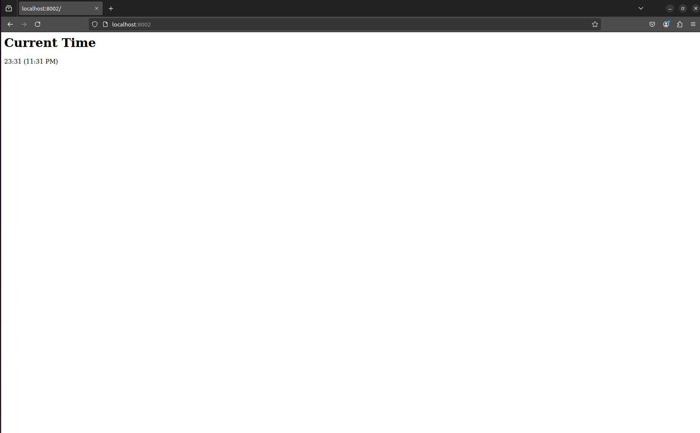
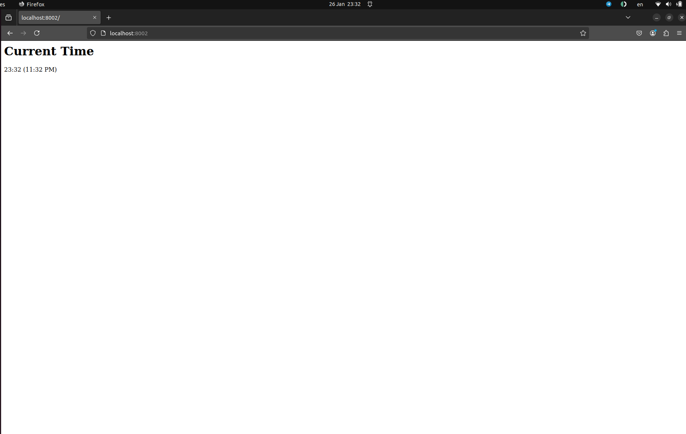

# Moscow Time Web-Application

## Framework Selection

I used Go for its simplicity, performance, and easy to use.

## Best Practices Followed

- App route and logic is kept in separate files so that making changes get better.
- Clean code structure.
- Clean code formatting.
- Proper code naming.
- Code documentation and comments.

## Coding Standards and Code Quality

- To have an unified coding styles and format, `gofmt` was used

## Testing

- I tested the application by running it and verifying that the displayed time in Moscow was shown correctly in the browser.

- Then, I refreshed the page to ensure that the time updated properly.

