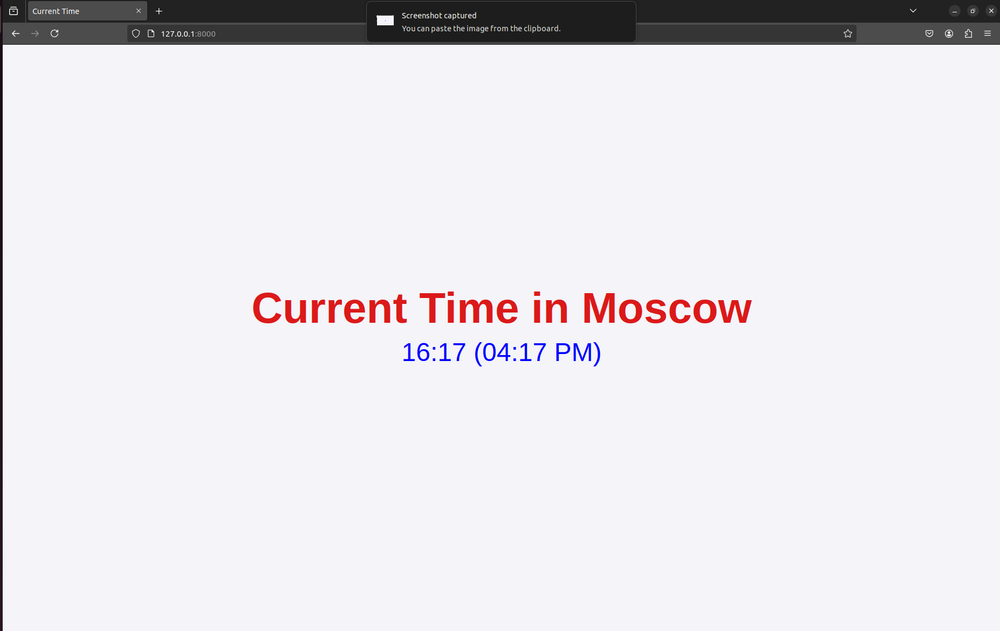

# Moscow Time Web-Application

## Framework Selection
I chosed FastAPI for this project because I'm already familiar with it, and it offers excellent performance, automatic validation, and ease of use for building modern web applications.

## Best Practices Followed
- The application was made as a python module so that unexpected import errors etc can be avoided.
- App route and logic is kept in separate files so that making changes get better.
- Code is formatted according to PEP8 standards.
- Clean code structure.
- Code documentation and comments.

## Coding Standards and Code Quality
- To have an unified coding styles, `black` was used
- To check the code style and quality, `Flake8` was used
- To sort and organize your import statements, `isort` was used.

## Testing
- I tested the application by running it and verifying that the displayed time in Moscow was shown correctly in the browser.

- Then, I refreshed the page to ensure that the time updated properly.

