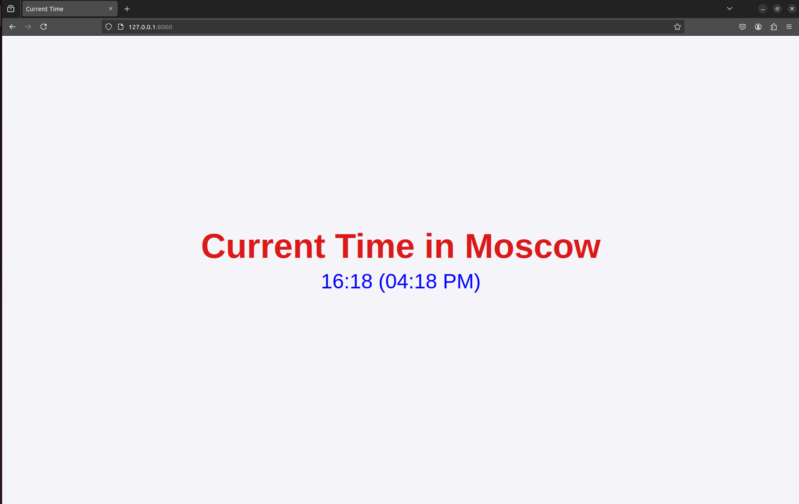

# Moscow Time Web-Application

This is a simple web application that displays the current time in Moscow. The application is developed using Python and FastAPI framework.

## Table of Contents
- [Python App](#python-app)
  - [Table of Contents](#table-of-contents)
  - [Installation](#installation)
    - [Requirements](#requirements)
    - [Installation Steps](#installation-steps)


# Installation

### Requirements

- Python 3.8 or higher
- `pip` package manager

### Installation Steps

- Clone this branch to your local machine

```bash
git clone git@github.com:saleemasekrea000/S25-core-course-labs.git -b lab1
```

- Navigate to the `app_python` folder

```bash
cd app_python
```

- Create and activate a virtual environment

```bash
python3 -m venv venv
source venv/bin/activate
```

- Install the required packages

```bash
pip install -r requirements.txt
```

- Run the application

```bash
cd ..
```

```bash
uvicorn app_python.app:app
```

The application will be available at [localhost:8000](http://localhost:8000/)

